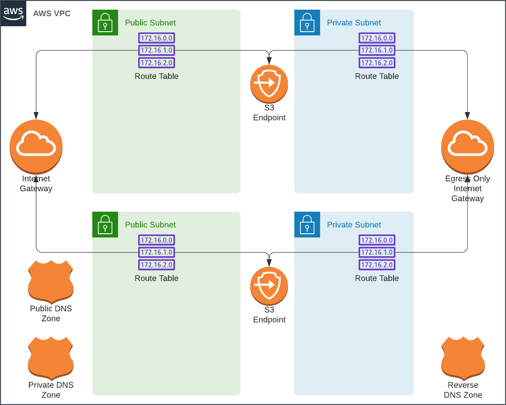
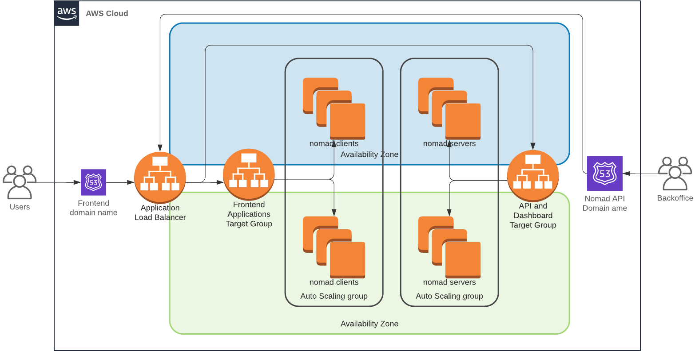

# HashiCorp Nomad Stack on AWS
This repository is infrastructure as code for a HashiCorp Nomad cluster in Amazon Web Sevices (AWS). There are multiple Terraform stacks in this codebase. Each one builds on the previous, so the have to be ran in order:

  * `terraform/manifests/vpc` - Deploys the VPC resources that can be shared with other stacks
  * `terraform/manifests/nomad` - Deploys the Nomad cluster
  * `terraform/manifests/app-hello` - Deploys a Hello World web service

## Architecture
Please see https://stan.borbat.com/terraform-nomad-cluster-part-1 for more information

### VPC

### Nomad

## Configuration
### Docker
This stack ships with a few docker containers that can were used for testing. They can be built by a tool of your choice, or by using the Makefiles that ship alongside. First you will need to edit `docker/Makefile` to set the REMOTE_REGION and REMOTE_ACCOUNT to match the region and AWS account where you're deploying the stack. You will also need to create matching repos in ECR using the AWS console. After configuration they can be built and published by running:

    pushd docker
    make build push
    popd

### Terraform
All modules expect `prefix` and `tags` variables. These are used for naming and tagging resources. Using these variables makes it easy to maintain multiple instances of the same stack. Presently, the `prefix` is derived from the name of the Terraform workspace, and `tags` from a lookup table in `terraform/manifests/environments.tf`. This file is used for configuring multiple instances of the same stack that are then deployed as Terraform workspaces. To keep it consistent across multiple stacks, it's presented as a symbolic link. Copy `environments-sample.tf` to `environments.tf` and customize it.

    variable "aws" {
      description = "AWS provider configuration"
      default = {
        # These are looked up for each workspace
        "prod" = {
          account = "000000000000"
          region  = "us-east-2"
          role    = "terraform-prod"
        }
        "dev" = {
          account = "000000000000"
          region  = "us-east-2"
          role    = "terraform-dev"
        }
      }
    }

    # You must have a top level domain for the "subdomain" that you specify here in the same AWS account
    # Delegation records will be automatically created in the TLD. The domain is used for the SSL certificate.
    variable "vpc" {
      description = "VPC configuration"
      default = {
        # These are looked up for each workspace
        "prod" = {
          vpc_cidr    = "10.3.0.0/20"
          subnet_mask = "24"
          domain      = "prod-aws.xeraweb.net"
        }
        "dev" = {
          vpc_cidr    = "10.2.128.0/20"
          subnet_mask = "24"
          domain      = "dev-aws.xeraweb.net"
        }
      }
    }

    variable "tags" {
      description = "Common tags for resources in a workspace"
      default = {
        # These are looked up for each workspace
        "prod" = {
          owner      = "stan@borbat.com"
          maintainer = "terraform"
          env        = "prod"
        }
        "dev" = {
          owner      = "stan@borbat.com"
          maintainer = "terraform"
          env        = "dev"
        }
      }
    }

    # The following are shared for all workspaces

    variable "github_username" {
      description = "GitHub username from which to pull the public SSH keys. First one will be used."
      default = "ordenull"
    }

    variable "trusted_cidr" {
      description = "Trusted WAN subnets used to secure SSH and Nomad Dashboard. Do not add 0.0.0.0/0"
      default = [
        "xx.xx.xx.xx/32" # Get your IP with http://checkip.dyndns.org
      ]
    }

The current code relies on using the `AWS_ACCESS_KEY_ID`, `AWS_SECRET_ACCESS_KEY` and `AWS_SESSION_TOKEN` credentials to assume an IAM role. Each environment can have it's own role, and limit what can be done with it. If you want to use the AWS access keys directly, you will need to edit the `provider.tf` in each stack.

For the provisioning to be fully automated, you will need to choose a subdomain from an already functioning TLD domain in Route53. In the above example, `xeraweb.net` is a Route53 domain in the same AWS account. The code discovers the existing Route53 zone and add records to delegate lookups for the `prod-aws.xeraweb.net` subdomain to the zone managed by this stack.

It's also vital that the `trusted_cidr` variable is limited to only a set of trusted networks. Anyone on these networks will have full access to Nomad and Consul dashboards.

## Build up
Deploy in the order of dependencies

### VPC
    pushd terraform/manifests/vpc
    terraform workspace new prod || terraform workspace select prod
    terraform apply

### Nomad Cluster
    pushd terraform/manifests/nomad
    terraform workspace new prod || terraform workspace select prod
    terraform apply
    popd

### Hello World Service
    pushd terraform/manifests/app-hello
    terraform workspace new prod || terraform workspace select prod
    terraform apply
    popd

## Tear down
Tear down in the reverse order

### Hello World Service
    pushd terraform/manifests/app-hello
    terraform workspace new prod || terraform workspace select prod
    terraform destroy
    popd

### Nomad Cluster
    pushd terraform/manifests/nomad
    terraform workspace new prod || terraform workspace select prod
    terraform destroy
    popd

### VPC
    pushd terraform/manifests/vpc
    terraform workspace new prod || terraform workspace select prod
    terraform destroy
    popd

## Security
Not an afterthought.

### VPC
All resources are deployed into public subnets utilizing security groups to limit inbound connections. This is done for cost reasons, NAT gateways and Private Link endpoints are expensive. The current cluster costs about $50 a month to run, plus the cost of traffic. The deployment topology can be changed by adjusting module parameters in the `vpc` and `nomad` stacks.

### Container network isolation
With the default deployment options, the containers running in the cluster will be prohibited from connecting to any of the Nomad and Consul endpoints. However, they will still be able to use Consul DNS for discovery. In some deployments, these restrictions can be loosened by changing options in `terraform/manifests/nomad/clients.tf`. They are documented in the module's `variables.tf`.

    # Harden the install
    enable_consul_dns     = true
    protect_consul_api    = true
    protect_host_ssh      = true
    protect_aws_metadata  = true
    protect_services      = true

### Dashboard access
The dashboards are available on the `nomad` and `consul` subdomains. In the shipped state, they are going to be provisioned at `nomad.prod-aws.xeraweb.net` and `consul.prod-aws.xeraweb.net`. Keep in mind that although they are limited to the trusted networks, they might not have cross site request protection. So anyone who knows the name of the cluster could craft a link that would submit a job to that cluster, and if you open that link from a trusted network that job would run.

## Terraform Stats
Count of resources managed by this stack (Excluding EC2 instances managed by auto-scaling groups)

    +----------------------------------+-------+
    | Type                             | Count |
    +----------------------------------+-------+
    | aws_acm_certificate              | 1     |
    | aws_acm_certificate_validation   | 1     |
    | aws_alb                          | 1     |
    | aws_alb_listener                 | 2     |
    | aws_alb_target_group             | 3     |
    | aws_autoscaling_attachment       | 3     |
    | aws_autoscaling_group            | 2     |
    | aws_default_route_table          | 1     |
    | aws_default_security_group       | 1     |
    | aws_egress_only_internet_gateway | 1     |
    | aws_iam_instance_profile         | 2     |
    | aws_iam_role                     | 2     |
    | aws_iam_role_policy              | 2     |
    | aws_iam_role_policy_attachment   | 4     |
    | aws_internet_gateway             | 1     |
    | aws_key_pair                     | 1     |
    | aws_launch_template              | 2     |
    | aws_lb_listener_rule             | 3     |
    | aws_route                        | 4     |
    | aws_route53_record               | 5     |
    | aws_route53_zone                 | 3     |
    | aws_route_table                  | 3     |
    | aws_route_table_association      | 4     |
    | aws_security_group               | 6     |
    | aws_security_group_rule          | 26    |
    | aws_subnet                       | 4     |
    | aws_vpc                          | 1     |
    | aws_vpc_dhcp_options             | 1     |
    | aws_vpc_dhcp_options_association | 1     |
    | aws_vpc_endpoint                 | 1     |
    | nomad_job                        | 1     |
    | Total                            | 93    |
    +----------------------------------+-------+
